# node-red-contrib-oring-paas

Node-RED nodes for the ORing PaaS.

[](https://nodered.org)
[](./LICENSE.md)

## Installation

Run the following command in the root directory of your Node-RED install

`npm install @oringnet/node-red-contrib-oring-paas`

or you can use the Palette Manager in Node-RED.

## Nodes

### oring paas thing

Create an end to end connection between ORing PaaS application and registerd thing.

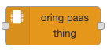

### oring paas dashboard chart adapter

Convert oring-paas-thing node output payload into [node-red-dashboard chart](https://github.com/node-red/node-red-dashboard/blob/master/Charts.md) payload.

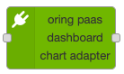

### oring paas dashboard gauge adapter

Convert oring-paas-thing node output payload into node-red-dashboard gauge payload.

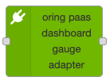

## Quick Start

### Step 1: Create an application on the ORing PaaS

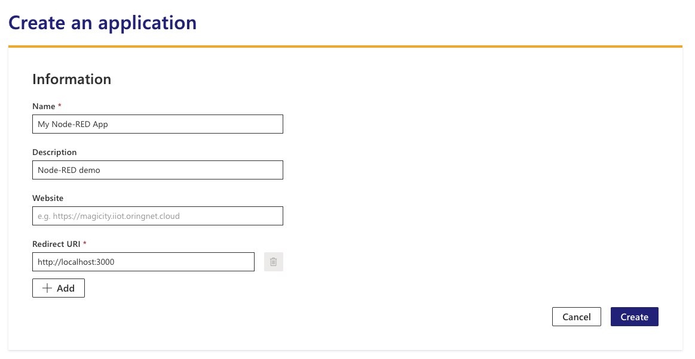

### Step 2: Generate an API Key

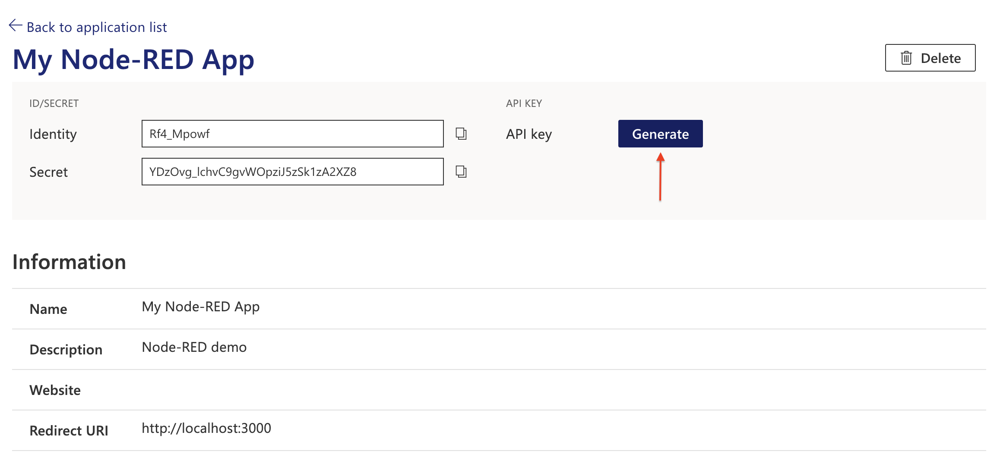

### Step 3: Add a new app config to the oring paas thing node

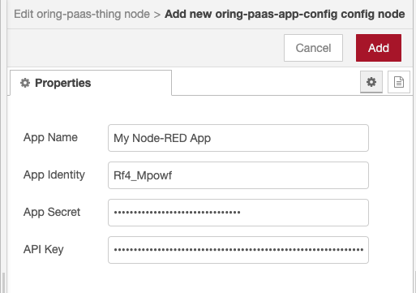

### Step 4: Copy the thing identity and name to the oring paas thing node

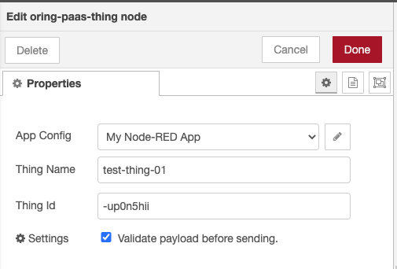

Deploy the node then you should see the node status is connected.

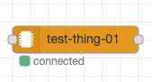

## Output Format

The oring paas thing node will subscribe to MQTT data topics and convert data payload into the following format:

```json
{
  "topic":"$thing/{thingId}/$data/sensorData",
  "data":{
    "timestamp":1591781444304,
    "values":[
      {"id":"GW1_00001", "value":0},
      {"id":"GW1_30801", "value":2}
    ]
  },
  "type":"stream"
}
```

## Build a Dashboard

You can build a [Node-RED dashboard](https://flows.nodered.org/node/node-red-dashboard) in just few steps by the dashboard adapter nodes.

### Dashboard Chart

#### Step 1: Step up oring paas thing node correctly

#### Step 2: Add oring paas dashboard chart adapter node to the flow

The node can be configured to include/exclude specific data identities.

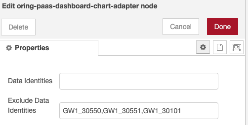

The node will convert oring paas thing node output into dashboard chart node input.

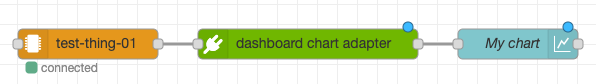

If set up correctly, a real-time chart will be displayed on the dashboard.

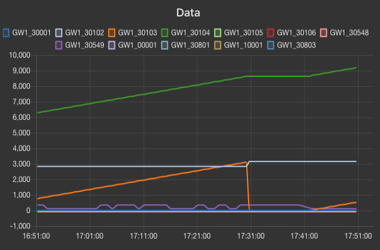

### Sending Command

You can send a command to the thing via oring paas thing node. The following example shows how to use the dashboard switch node to send a on/off command to the thing.

#### Step 1: Add a dashboard switch node to the flow

#### Step 2: Add a function node to convert switch on/off into a valid input

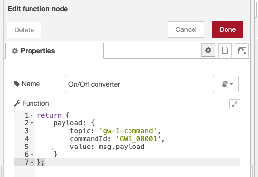

The oring paas thing node input example:

```json
{
  "topic": "gw-1-command",
  "commandId": "GW1_00001",
  "value": true
}
```

The flow should look like this:

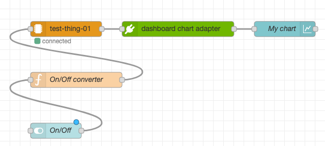

After the switch being toggled, the command will be sent to `$thing/{thingId}/$cmd/$downlink/gw-1-command` topic with the following payload:

```json
{
  "id": "GW1_00001",
  "value": true
}
```

## License

© ORing Industrial Networking Corp., 2020-NOW

Released under the [MIT License](https://github.com/ORingnet/node-red-contrib-oring-paas/blob/master/LICENCE)
